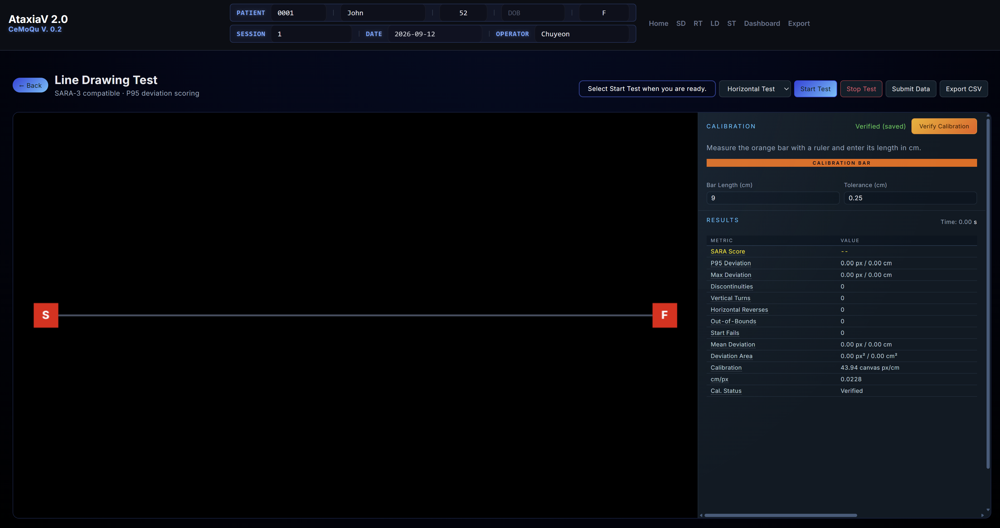
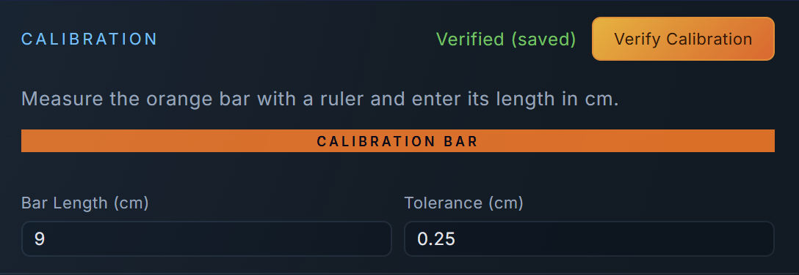
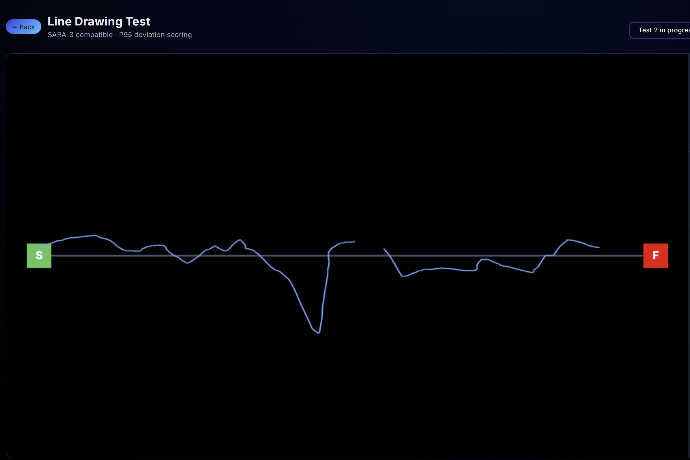

# LD — Line Drawing Test

Part of **CeMoQu** (Cerebellar Motor Quantification), a browser-based platform that measures movement, speech, and coordination features relevant to cerebellar ataxia using standard web technologies.

This module (**LD**) is a guided line-tracing task. It asks a participant to draw from an **S** start marker to an **F** finish marker while the app records cursor/touch movement, deviation from the ideal guide line, movement interruptions, directional reversals, and completion timing. The current default workflow is a **five-trial horizontal line drawing sequence** with recorded audio instructions and a visible countdown.

> **This is a research prototype, not a diagnostic tool.** It does not replace a clinician's judgment or the official SARA examination. The displayed score is a provisional research estimate based on the current engineering thresholds and has not been clinically validated.



## What this task is trying to measure

The LD task standardizes a simple upper-limb coordination challenge: tracing a straight path accurately from start to finish. The browser records the movement path continuously and converts pixel-based movement data into centimeters through an on-screen calibration bar.

The current implementation focuses on one primary scoring metric:

- **P95 deviation** — the 95th-percentile distance between the participant's drawn path and the ideal guide line.

The module also records several research metrics that may be useful for later validation:

| Metric | Plain-language meaning | Current scoring role |
|---|---|---:|
| P95 deviation | Sustained distance from the ideal guide line | Primary score metric |
| Max deviation | Largest single deviation from the guide line | Research/export only |
| Mean deviation | Average deviation across recorded samples | Research/export only |
| Deviation area | Cumulative area between the drawn trace and ideal line | Research/export only |
| Discontinuities | Number of times drawing was released and restarted | Research/export only |
| Vertical turns | Sustained up/down reversals | Research/export only |
| Horizontal reverses | Sustained left/right reversals | Research/export only |
| Out-of-bounds | Times the pointer left the canvas during an active trial | Research/export only |
| Start fails | Attempts that began outside the start marker | Research/export only |
| Duration | Time from `GO` to finish | Research/export only |

## Current test flow

The current guided sequence is designed around the horizontal test because recorded audio prompts are included for five horizontal trials.

1. Confirm participant/session metadata in the shared CeMoQu header.
2. Measure the orange calibration bar with a physical ruler.
3. Enter the measured bar length in centimeters.
4. Enter the tolerance value in centimeters.
5. Click **Verify Calibration**.
6. Select **Horizontal Test**.
7. Click **Start Test**.
8. Listen to the recorded prompt and watch the visible countdown.
9. Begin drawing at **GO**.
10. Start inside the **S** marker and finish inside the **F** marker.
11. Complete all five trials.
12. Review results and export data.






## Current interface

The LD interface uses a 70/30 layout:

- The left side is the drawing canvas.
- The right side contains calibration, settings, live results, and export controls.

The canvas uses a fixed internal coordinate system of **1000 × 700** units. The displayed canvas is responsive, so calibration converts the physical screen measurement into the internal coordinate space used by the calculation functions.

## How scoring works

The current score uses only P95 deviation in centimeters.

| P95 deviation | Score | Label |
|---:|---:|---|
| `< 0.5 cm` | 0 | Normal |
| `0.5–<2.0 cm` | 1 | Mild |
| `2.0–5.0 cm` | 2 | Moderate |
| `> 5.0 cm` | 3 | Severe |
| Incomplete trial or unverified calibration | 4 | Unable to perform |

This mapping is provisional. It is not a clinically validated SARA cutoff table.

For the exact calculation path, see [`METHODOLOGY.md`](./METHODOLOGY.md).

## Exports

The module supports two export paths:

- **Export CSV** — downloads a CSV containing all completed trials in the browser.
- **Submit Data** — sends the current trial payload to the configured Google Apps Script endpoint.

Exported fields include participant/session metadata, trial number, timestamp, duration, calibration values, deviation metrics, movement-event counts, score, label, and completion status.

## Limitations

- The score thresholds are engineering placeholders and have not been calibrated against clinician-rated patient data.
- The task is a standardized line-tracing proxy and does not reproduce the full clinical richness of a clinician-observed upper-limb exam.
- The current score uses P95 deviation only; discontinuities, turns, reversals, area, and timing are exported but not yet part of the score.
- Calibration depends on the user's physical measurement of an on-screen bar and can be affected by display scaling, browser zoom, screen resizing, and inaccurate ruler placement.
- The guided audio sequence is currently implemented for the horizontal five-trial test.
- Validation is still required across devices, screen sizes, input methods, healthy controls, and cerebellar ataxia participants.

## Required project structure

The LD folder must remain inside the main CeMoQu project because it loads shared header and style files from `../shared/`.

```text
CeMoQu/
├── shared/
│   ├── common.css
│   ├── header.css
│   ├── header.html
│   └── header.js
└── LD/
    ├── README.md
    ├── METHODOLOGY.md
    ├── TASK-DESIGN-RATIONALE.md
    ├── VERIFICATION-REPORT.md
    ├── index.html
    ├── styles.css
    ├── app.js
    ├── ld-interface.png
    ├── docs/
    │   └── screenshots/
    └── audio/
```

## Running locally

Do not open `index.html` directly from `file://`. Use a local server so the shared CeMoQu header loads correctly.

Example with VS Code Live Server:

1. Open the main CeMoQu project folder in VS Code.
2. Open `LD/index.html`.
3. Select **Open with Live Server**.
4. Confirm the page opens from a local HTTP address such as `http://127.0.0.1:5500/LD/index.html`.

## Where to look next

- [`METHODOLOGY.md`](./METHODOLOGY.md) — every method used to turn cursor/touch movement into measurements and the current provisional score.
- [`TASK-DESIGN-RATIONALE.md`](./TASK-DESIGN-RATIONALE.md) — why this task, why calibration is required, why P95 is currently primary, and why other metrics are retained.
- [`VERIFICATION-REPORT.md`](./VERIFICATION-REPORT.md) — what has been checked, what remains unverified, and what is required before clinical validation.
