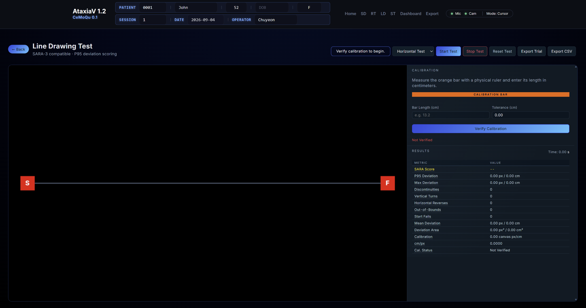

# CeMoQu Line Drawing Test (LD)

Browser-based line drawing assessment for recording tracing accuracy, movement interruptions, directional changes, and task completion. The module is designed for the CeMoQu interface and uses the shared CeMoQu header and common styles.

> Research prototype: the current score mapping and tolerance values have not yet been clinically validated. The Line Drawing Test is not an official standalone SARA item.

## Current Interface



The test area occupies approximately 70% of the workspace. Calibration and live results remain visible in the right-side panel during testing.

## Main Features

- Horizontal and vertical line drawing modes
- Physical on-screen calibration bar
- Configurable line tolerance in centimeters
- Five-trial guided horizontal test sequence
- Recorded audio instructions and visible `3, 2, 1, GO` countdown
- Automatic timing beginning at `GO`
- Live result display beside the test area
- Trial export and multi-trial CSV export
- Calibration settings saved in the browser with `localStorage`
- Shared CeMoQu header and common site styling

## Required Project Structure

The LD folder must remain inside the main CeMoQu project because it loads shared files from `../shared/`.

```text
CeMoQu/
├── shared/
│   ├── common.css
│   ├── header.css
│   ├── header.html
│   └── header.js
└── LD/
    ├── index.html
    ├── styles.css
    ├── app.js
    ├── README.md
    ├── ld-interface.png
    └── audio/
        ├── 01_intro_horizontal.mp3
        ├── 02_start_test_1.mp3
        ├── 03_test_1_complete.mp3
        ├── 04_start_test_2.mp3
        ├── 05_test_2_complete.mp3
        ├── 06_start_test_3.mp3
        ├── 07_test_3_complete.mp3
        ├── 08_start_test_4.mp3
        ├── 09_test_4_complete.mp3
        ├── 10_start_test_5.mp3
        └── 11_horizontal_complete.mp3
```

## Running Locally

Do not open `index.html` directly with a `file://` address. The shared header is loaded with JavaScript and requires a local web server.

### VS Code Live Server

1. Open the main `CeMoQu` project folder in VS Code.
2. Install the **Live Server** extension if needed.
3. Open `LD/index.html`.
4. Select **Open with Live Server**.

The page should open from an address similar to:

```text
http://127.0.0.1:5500/LD/index.html
```

## Test Procedure

1. Confirm the participant and session information in the shared header.
2. Measure the orange calibration bar with a physical ruler.
3. Enter the measured length in centimeters.
4. Enter the desired tolerance in centimeters.
5. Select **Verify Calibration**.
6. Select the test type.
7. Select **Start Test**.
8. Wait for the visible and recorded countdown.
9. Begin drawing when `GO` appears.
10. Start inside the `S` marker and finish inside the `F` marker.
11. For the horizontal guided sequence, complete all five trials.
12. Export the current trial or all completed trials as CSV.

## Result Metrics

| Metric | Description | Used for current score |
|---|---|---:|
| SARA Score | Prototype 0–4 score derived from P95 deviation | — |
| P95 Deviation | Distance containing 95% of deviations from the guide line | Yes |
| Max Deviation | Largest single deviation from the guide line | No |
| Mean Deviation | Average deviation across recorded points | No |
| Deviation Area | Accumulated area between the trace and guide line | No |
| Discontinuities | Number of times drawing was released and restarted | No |
| Vertical Turns | Sustained vertical direction reversals | No |
| Horizontal Reverses | Sustained horizontal direction reversals | No |
| Out-of-Bounds | Number of times the cursor left the canvas during a trial | No |
| Start Fails | Attempts that began outside the start marker | No |
| Calibration | Canvas pixels represented by one centimeter | Conversion only |
| cm/px | Real-world centimeters represented by one canvas pixel | Conversion only |

P95 is used instead of the maximum deviation to reduce the influence of a single extreme point. The other metrics are retained for research and export but currently do not affect the score.

## Current Prototype Score Mapping

| P95 deviation | Score | Label |
|---:|---:|---|
| Less than 0.5 cm | 0 | Normal |
| 0.5–2.0 cm | 1 | Mild |
| 2.0–5.0 cm | 2 | Moderate |
| More than 5.0 cm | 3 | Severe |
| Incomplete trial or unverified calibration | 4 | Unable to perform |

These thresholds are provisional research settings. They must not be interpreted as clinically validated SARA thresholds.

## Direction-Change Filtering

Small cursor fluctuations can incorrectly appear as turns or reversals. The current prototype uses a temporary `0.25 cm` movement tolerance and a sustained-reversal condition to reduce counts caused by coordinate noise or minor tremor.

This value is provisional and must be tested using healthy control and patient data.

## Exported Data

The CSV export includes participant/session metadata, test mode, trial number, timestamp, duration, calibration values, tolerance, deviation measurements, movement-event counts, prototype score, and completion status.

The current browser version downloads files through the browser. A browser running through Live Server cannot silently save CSV files directly into the project's `data/` folder without additional permission or a local/server-side save method.

## Clinical Questions to Review

- Should a single large jump be counted as a clinical movement abnormality or treated as an accidental outlier?
- Is P95 deviation an appropriate primary measurement for this task?
- What distance from the guide line should be treated as normal variation?
- Should tolerance be fixed or adjusted for the display, input device, or participant?
- What minimum distance or duration should define a clinically meaningful turn or reversal?
- Should turn and reversal counts affect scoring or remain research-only metrics?
- Should the right and left hands be scored separately?
- Is `SARA-compatible` an acceptable description for this prototype?

## Planned Work

- Add a required right-hand/left-hand selector.
- Store hand information separately for every trial.
- Redesign filenames to include participant ID, session, date/time, hand, test type, and trial number.
- Add a method for saving CSV files into a project `data/` folder.
- Validate the guide-line tolerance using healthy control data.
- Validate the `0.25 cm` direction-change filter with real test data.
- Reassess the P95-to-score thresholds using clinician-reviewed patient data.
- Test the interface at different monitor sizes and browser zoom levels.

## Files

- `index.html` — LD page structure and controls
- `styles.css` — LD-specific layout and visual styling
- `app.js` — drawing, calibration, audio sequence, calculations, results, and export logic
- `audio/` — recorded horizontal-test instructions
- `ld-interface.png` — current interface screenshot used in this README

## Intended Use

This module is intended for research, prototyping, and data collection. It is not a diagnostic medical device and should not be used for clinical decisions until its measurements and scoring rules have been validated.
