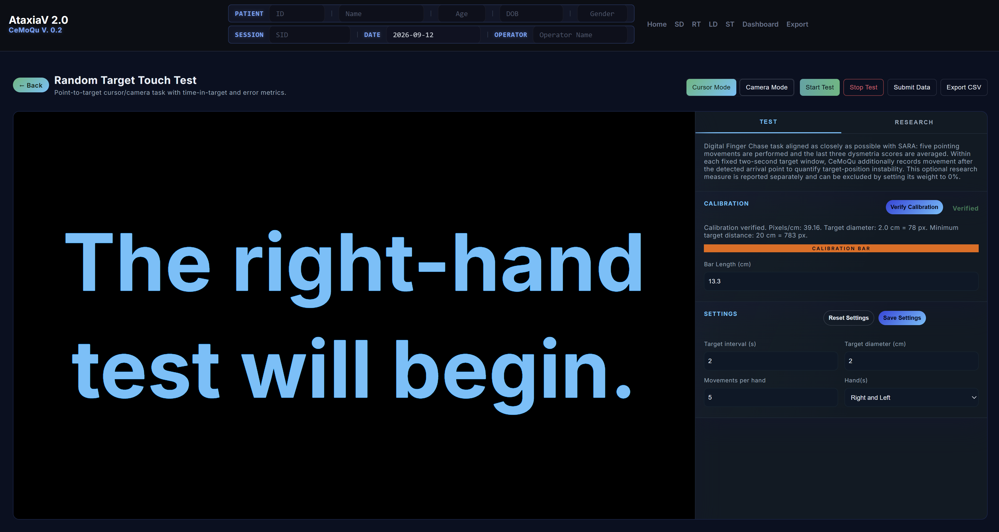

# RT — Random Target Touch Test

Part of **CeMoQu** (Cerebellar Motor Quantification), a browser-based platform for quantitative assessment of motor and speech symptoms related to cerebellar ataxia using standard consumer devices.

This module (**RT**) is a short, guided pointing task modeled after the logic of the **SARA Finger Chase** item. It asks the participant to move toward randomly placed targets and produces a **provisional SARA Finger Chase estimate** together with the raw measurements used to compute it.

> **This is a research prototype, not a diagnostic tool.** It does not replace a clinician's judgment or the official SARA examination. Every score produced by this module should be treated as a provisional research estimate pending clinical validation.

---

## What SARA Finger Chase normally measures

In the official SARA examination, Finger Chase is scored by a clinician while the participant performs repeated pointing movements toward the examiner's finger. The clinician judges **dysmetria**, or the spatial error/overshoot of the pointing movement.

RT does **not** replicate the clinician-administered exam directly. Instead, it standardizes the pointing target on a screen and records movement data from either a direct cursor/touch input or a webcam-based fingertip tracker. This tradeoff makes the task more repeatable and exportable, but it also means that the current score remains an engineering estimate until compared with clinician-rated SARA Finger Chase scores.

---

## Two measurement modes

RT supports two modes. They intentionally use separate measurement pipelines.

| Mode | What it uses | Calibration method | Movement distance |
|---|---|---|---|
| **Cursor Mode** | Mouse, trackpad, or touchscreen pointer | Screen calibration bar | Consecutive targets at least 20 cm apart |
| **Camera Mode** | Webcam + MediaPipe hand tracking | Index-finger length calibration | Consecutive targets exactly 30 cm apart |

The design principle is:

> **Measurement is mode-specific. Analysis is shared.**

That means Cursor Mode and Camera Mode obtain movement data differently, but after each mode produces standardized `x`, `y`, and time samples, the same analysis pipeline is used for arrival detection, dysmetria, tremor, summary metrics, and scoring.


---

## Cursor Mode workflow

Cursor Mode is intended for mouse, trackpad, or touchscreen use. It does not use the camera.

1. Select **Cursor Mode**.
2. Measure the orange calibration bar with a physical ruler.
3. Enter the measured bar length in centimeters.
4. Click **Verify Calibration**.
5. Confirm that the screen shows calibration as verified.
6. Click **Start Test**.
7. Complete the right-hand run.
8. Complete the left-hand run.
9. Review the final score and exported measurements.

Cursor Mode must be calibrated before the test can start. Calibration values are kept only within the current browser session; reopening the module requires calibration again.


---

## Camera Mode workflow

Camera Mode is intended for webcam-based fingertip tracking.

1. Select **Camera Mode**.
2. Enter the participant's actual index-finger length in centimeters.
3. Click **Auto Calibration**.
4. Open the palm and show the hand to the camera when prompted.
5. The system performs four calibration measurements: Right, Left, Right, Left.
6. The app displays only the final average calibration value.
7. Click **Start Test**.
8. Complete the right-hand run.
9. Complete the left-hand run.
10. Review the final score and exported measurements.

The four-measurement average is used because a single camera-based measurement can be affected by hand distance, temporary tracking jitter, angle, or posture.


---

## Test sequence

The default setting is **5 movements per hand**, **2 seconds per target**, and **Right and Left** hands.

The test sequence is:

```text
Calibration
→ Start Test
→ Right-hand test will begin
→ 3, 2, 1 countdown
→ Right-hand target sequence
→ Left-hand test will begin
→ 3, 2, 1 countdown
→ Left-hand target sequence
→ Final result
```




---

## Measurements produced

For each target, RT records and summarizes the following values:

| Measurement | Meaning |
|---|---|
| Final distance to target | Distance from the final recorded pointer/fingertip position to the target center |
| Arrival distance | Distance from the target center when the movement is judged to have arrived |
| Reaction time | Time from target onset to first entry inside the target |
| Time inside target | Total time spent inside the target window |
| Percent time inside | Percent of the fixed target window spent inside the target |
| Post-arrival P95 radius | Experimental estimate of post-arrival instability/tremor |
| Tracking spikes removed | Number and percent of samples removed as tracking outliers |
| Measured FPS | Actual sampling rate during the trial |

The current scoring pipeline uses the **arrival-distance dysmetria score** and the **post-arrival tremor score**. Other measurements are exported and displayed for research review, but they are not yet part of the final SARA Finger Chase score.

---

## How scoring works

The current scoring configuration is `rt-scoring-v1`.

Each target produces:

1. **Dysmetria score** from arrival distance.
2. **Tremor score** from post-arrival P95 radial deviation, when available.
3. **CeMoQu weighted score** from dysmetria and tremor.

The SARA-aligned Finger Chase score currently uses the dysmetria score from the **last three movements**, matching the SARA-style five-movement structure where the final three pointing movements are averaged.

```text
SARA Finger Chase Score = average of dysmetria scores from the last 3 valid movements
```

If tracking is missing, the run is marked unavailable rather than being automatically scored as 4.

For the exact thresholds, formulas, and examples, see [`METHODOLOGY.md`](./METHODOLOGY.md).


---

## Exports

RT exports session-level, target-level, and frame-level information as CSV files. It also creates trajectory images for individual trials.

Typical exported data include:

- participant/session metadata
- mode and hand
- target locations and radius
- raw pointer/fingertip samples
- inside/outside target status
- reaction time
- arrival distance
- post-arrival tremor estimate
- trial-level scores
- run-level summary scores
- scoring configuration

---

## Limitations

- The score is not clinically validated.
- Thresholds and weights are engineering placeholders.
- Camera Mode depends on webcam quality, frame rate, lighting, hand pose, and MediaPipe tracking stability.
- Cursor Mode depends on screen calibration, browser zoom, window size, monitor scaling, and pointer/touch behavior.
- Camera and Cursor measurements should not be assumed interchangeable until tested directly.
- Reaction time, time-inside, smoothness, and other exported measures require validation before being used as scored biomarkers.
- Low camera FPS may reduce confidence in tremor-related measurements.
- A successful browser test is not the same as clinical validation.

---

## Where to look next

This module follows the same four-document structure used for the SD module:

- [`METHODOLOGY.md`](./METHODOLOGY.md) — how raw cursor/camera movement becomes measurements and scores
- [`TASK-DESIGN-RATIONALE.md`](./TASK-DESIGN-RATIONALE.md) — why this task design, why two modes, why these distances, and why these metrics
- [`VERIFICATION-REPORT.md`](./VERIFICATION-REPORT.md) — what has been checked, what remains unverified, and what is required before clinical validation

**Current scoring configuration:** `rt-scoring-v1`
