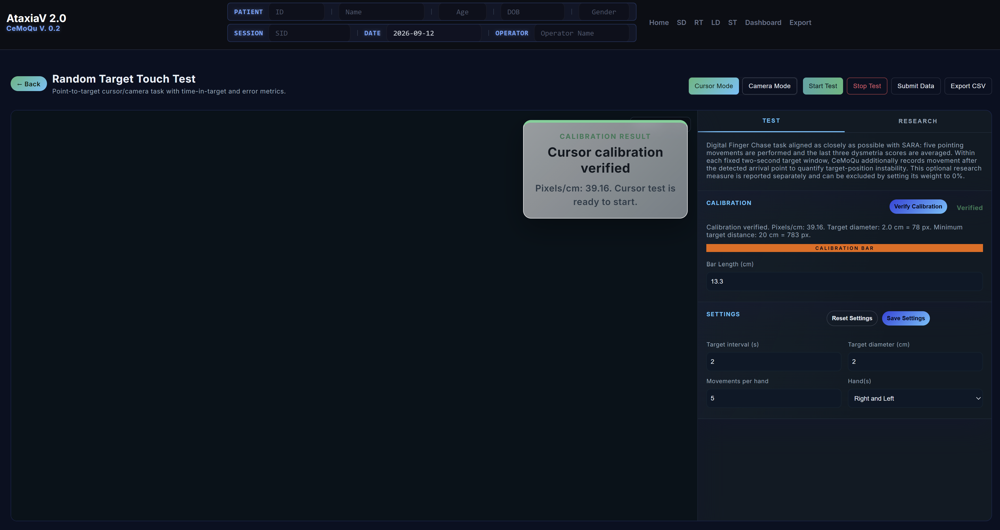

# CeMoQu RT — Random Target Touch Test

**Module:** RT (Random Target Touch / Digital Finger Chase)  
**Project:** CeMoQu — Cerebellar Motor Quantification  
**Current build reviewed:** `RT091226`  
**Main files:** `index.html`, `styles.css`, `app.js`

CeMoQu RT is a browser-based upper-limb coordination test designed to collect quantitative movement data from a point-to-target task. The module supports two measurement modes:

1. **Cursor Mode** — direct touch, mouse, or trackpad input on the screen.
2. **Camera Mode** — webcam-based index-finger tracking using MediaPipe Hands.

The two modes use separate calibration and measurement pipelines, then share the same analysis pipeline for reaction time, dysmetria, tremor/hold instability, scoring, result display, and CSV export.



---

## 1. Main Purpose

The RT module measures how accurately and quickly a participant moves toward visual targets. It is inspired by the SARA Finger Chase task, but implemented digitally so that repeated, remote, and quantitative testing is possible.

The module records:

- target location
- cursor or fingertip trajectory
- reaction time
- final error
- arrival-point error
- time inside target
- post-arrival instability / tremor estimate
- right-hand and left-hand summaries
- final SARA-like RT score

---

## 2. File Structure

```text
RT/
├── index.html                 # RT user interface and page structure
├── styles.css                 # RT-only visual layout and styling
├── app.js                     # RT logic: modes, calibration, testing, scoring, export
├── test_scoring.js            # Scoring-related test helper file
├── README.md                  # User/developer overview
├── METHODOLOGY.md             # Calculation and analysis method
├── TASK-DESIGN-RATIONALE.md   # Design decisions and why they were made
└── VERIFICATION-REPORT.md     # Manual QA and verification checklist
```

The RT page also loads shared CeMoQu assets:

```html
../shared/common.css
../shared/header.css
../shared/header.js
```

These shared files should not be changed from inside the RT module unless the change is intentionally meant to affect other CeMoQu modules.

---

## 3. Core Design Principle

Cursor Mode and Camera Mode are intentionally separated at the measurement level.

```text
Cursor Mode measurement
  ├── screen-based calibration
  ├── direct pointer input
  ├── cursor cm↔px conversion
  └── cursor target generation

Camera Mode measurement
  ├── webcam-based hand tracking
  ├── finger-length calibration
  ├── camera cm↔px conversion
  └── camera target generation

Both modes
  └── shared analysis pipeline
      ├── reaction time
      ├── arrival detection
      ├── dysmetria
      ├── tremor / hold instability
      ├── scoring
      ├── result display
      └── CSV export
```

This separation prevents a Cursor Mode change from accidentally breaking Camera Mode, while keeping the final analysis consistent across both input methods.

---

## 4. Default Protocol

| Setting | Current default / behavior |
|---|---:|
| Movements per hand | 5 |
| Target interval | 2.0 seconds |
| Target diameter | 3.0 cm |
| Target radius used internally | 1.5 cm |
| Cursor Mode target spacing | At least 20 cm between consecutive targets |
| Camera Mode target spacing | 30 cm movement distance |
| Hands tested | Right and left by default |
| Right/left start message duration | 3 seconds |
| Right/left start message font size | 13px |
| Countdown | 3, 2, 1 |


---

## 5. Cursor Mode User Flow

Cursor Mode uses a physical on-screen calibration bar. The user measures the orange calibration bar with a ruler and enters the measured length in centimeters.

```text
Select Cursor Mode
→ Previous results/messages are cleared
→ Cursor calibration instruction appears
→ User measures the orange calibration bar
→ User enters bar length
→ User clicks Verify Calibration
→ Calibration result is shown
→ Start Test becomes available
→ Right-hand test begins
→ 3, 2, 1 countdown
→ Right-hand movements
→ Left-hand test begins
→ 3, 2, 1 countdown
→ Left-hand movements
→ Final result is displayed
```

Cursor Mode must not begin a test until calibration has been verified.


---

## 6. Camera Mode User Flow

Camera Mode uses webcam hand tracking. The participant enters the actual index finger length in centimeters, then runs Auto Calibration.

```text
Select Camera Mode
→ Previous results/messages are cleared
→ User enters actual index finger length
→ User clicks Auto Calibration
→ Program asks user to open palm and show hand to camera
→ Calibration 1: Right hand
→ Calibration 2: Left hand
→ Calibration 3: Right hand
→ Calibration 4: Left hand
→ Average pixels/cm is calculated from the 4 measurements
→ Final calibration result is shown
→ Start Test becomes available
→ Right-hand test begins
→ 3, 2, 1 countdown
→ Right-hand movements
→ Left-hand test begins
→ 3, 2, 1 countdown
→ Left-hand movements
→ Final result is displayed
```

During the four calibration captures, intermediate raw calibration values are logged for verification but the user-facing flow should remain simple. The final average is used as the Camera Mode scale.


---

## 7. Calibration Storage Rule

Calibration results should be treated as session-specific values.

- A newly opened RT page should require calibration again.
- Within the same open page/session, calibration values may remain available while switching between Cursor Mode and Camera Mode.
- Calibration should not be trusted across browser reloads, monitor changes, browser zoom changes, camera position changes, or window-size changes.

This is especially important for Cursor Mode because the physical centimeter scale depends on screen size, display scaling, and browser zoom.

---

## 8. Target Generation

Target locations are generated at the beginning of each hand run.

```text
Start Test
→ new right-hand target set is generated
→ right-hand test runs
→ new left-hand target set is generated
→ left-hand test runs
```

Cursor Mode and Camera Mode use different target generation rules:

- **Cursor Mode:** consecutive targets must be at least 20 cm apart.
- **Camera Mode:** consecutive targets use a 30 cm movement distance.


---

## 9. Results and Export

At the end of the session, the module displays the final result and stores a summary for export.

Results may include:

- right-hand score
- left-hand score
- final score
- reaction time
- final error
- arrival-point error
- tremor / hold instability
- time inside target
- smoothness
- missed trials
- mode and configuration values


The page includes an **Export CSV** button. The module also includes a **Submit Data** flow intended to upload de-identified summary metrics only.

---

## 10. Required Screenshots

Capture these screenshots for the repository documentation:

1. `rt-main-cursor-mode.png` — full RT screen with Cursor Mode selected.
2. `settings-defaults.png` — Settings panel with 5 movements, 2s interval, 3cm target diameter.
3. `cursor-calibration-before-verify.png` — Cursor calibration bar before verification.
4. `cursor-calibration-verified.png` — Cursor calibration result after Verify Calibration.
5. `camera-mode-enter-finger-length.png` — Camera Mode after selection, showing finger-length input.
6. `camera-auto-calibration-open-palm.png` — Auto Calibration instruction asking user to show open palm.
7. `camera-calibration-average-result.png` — final averaged Camera calibration result.
8. `rt-phase-message-right.png` — “The right-hand test will begin.” message.
9. `rt-countdown.png` — 3, 2, 1 countdown overlay.
10. `rt-running-target-test.png` — active target test screen.
11. `final-result-overlay.png` — final score display.
12. `log-camera-calibration-values.png` — log showing the four Camera calibration measurements and average.

---

## 11. Development Notes

Current important implementation boundaries:

- `beginCurrentHandRun()` routes execution to mode-specific hand-run functions.
- `beginCursorHandRun()` handles Cursor Mode target generation.
- `beginCameraHandRun()` handles Camera Mode target generation.
- `generateCursorTargets()` applies the Cursor Mode spacing rule.
- `generateCameraTargets()` preserves the Camera Mode 30 cm movement rule.
- `runCameraCalibrationSequence()` performs the four-step Camera Auto Calibration.
- `processTrialSample()` is part of the shared analysis pipeline.

Do not merge Cursor and Camera measurement logic back into one pathway. Camera Mode is sensitive and should be modified conservatively.
