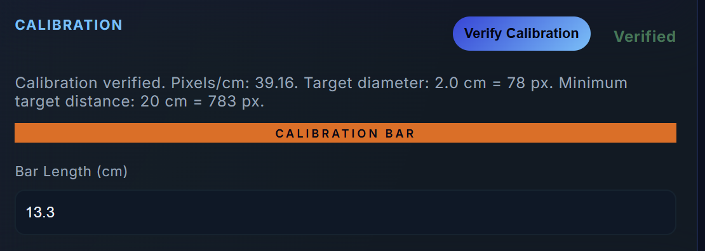

# CeMoQu RT — Verification Report

**Module:** RT — Random Target Touch / Digital Finger Chase  
**Build reviewed:** `RT091226`  
**Files reviewed:** `index.html`, `styles.css`, `app.js`  
**Purpose:** Manual QA checklist for confirming that the RT module works as intended after recent Cursor/Camera Mode refactoring and UI changes.

---

## 1. Verification Summary

This report verifies four main areas:

1. Cursor Mode calibration and target behavior.
2. Camera Mode four-step Auto Calibration.
3. Right-hand and left-hand test sequence.
4. Result display, logging, and export readiness.

The most important risk area is Camera Mode because it depends on MediaPipe, webcam coordinate mapping, calibration timing, and target generation.

---

## 2. Test Environment Record

Fill this section during manual testing.

| Item | Value |
|---|---|
| Date tested |  |
| Tester |  |
| Browser |  |
| Operating system |  |
| Device / monitor |  |
| Browser zoom |  |
| Camera resolution shown in log |  |
| RT build / zip file | `RT091226` |


---

## 3. Static File Checks

| Check | Expected result | Status |
|---|---|---|
| `index.html` loads | Page opens without broken layout | ☐ Pass ☐ Fail |
| `styles.css` loads | RT-specific visual layout is applied | ☐ Pass ☐ Fail |
| `app.js` loads | No JavaScript syntax error in console | ☐ Pass ☐ Fail |
| Shared header loads | CeMoQu header appears | ☐ Pass ☐ Fail |
| MediaPipe scripts load | Camera Mode can initialize | ☐ Pass ☐ Fail |

Notes:

```text

```

---

## 4. Settings Verification

Expected default settings:

| Setting | Expected value | Status |
|---|---:|---|
| Movements per hand | 5 | ☐ Pass ☐ Fail |
| Target interval | 2.0 s | ☐ Pass ☐ Fail |
| Target diameter | 3.0 cm | ☐ Pass ☐ Fail |
| Hand(s) | Right and Left | ☐ Pass ☐ Fail |
| Cursor spacing | ≥20 cm | ☐ Pass ☐ Fail |
| Camera movement | 30 cm | ☐ Pass ☐ Fail |


---

## 5. Cursor Mode Verification

### 5.1 Cursor Mode Selection

| Step | Expected result | Status |
|---|---|---|
| Click Cursor Mode | Cursor Mode becomes active | ☐ Pass ☐ Fail |
| Previous results are cleared | No old score remains visible | ☐ Pass ☐ Fail |
| Calibration instruction appears | User is asked to measure calibration bar | ☐ Pass ☐ Fail |


### 5.2 Cursor Calibration

| Step | Expected result | Status |
|---|---|---|
| Enter measured bar length | Value is accepted | ☐ Pass ☐ Fail |
| Click Verify Calibration | Calibration result appears | ☐ Pass ☐ Fail |
| Start Test before verification | Should be blocked | ☐ Pass ☐ Fail |
| Start Test after verification | Should be allowed | ☐ Pass ☐ Fail |



### 5.3 Cursor Target Generation

| Step | Expected result | Status |
|---|---|---|
| Start Test | New right-hand targets are generated | ☐ Pass ☐ Fail |
| Complete right-hand run | Left-hand run begins | ☐ Pass ☐ Fail |
| Left-hand run starts | New left-hand targets are generated | ☐ Pass ☐ Fail |
| Consecutive cursor targets | At least 20 cm apart | ☐ Pass ☐ Fail |

Notes:

```text

```

---

## 6. Camera Mode Verification

### 6.1 Camera Mode Selection

| Step | Expected result | Status |
|---|---|---|
| Click Camera Mode | Camera Mode becomes active | ☐ Pass ☐ Fail |
| Previous results are cleared | No old result remains visible | ☐ Pass ☐ Fail |
| Camera instruction appears | User is asked to enter actual index finger length | ☐ Pass ☐ Fail |
| Camera starts | Log shows camera resolution, e.g. 1280×720 | ☐ Pass ☐ Fail |


### 6.2 Auto Calibration Flow

| Step | Expected result | Status |
|---|---|---|
| Enter finger length, e.g. 6.0 | Value is used in calibration calculation | ☐ Pass ☐ Fail |
| Click Auto Calibration | Open-palm instruction appears | ☐ Pass ☐ Fail |
| Calibration 1 | Right hand is captured | ☐ Pass ☐ Fail |
| Calibration 2 | Left hand is captured | ☐ Pass ☐ Fail |
| Calibration 3 | Right hand is captured | ☐ Pass ☐ Fail |
| Calibration 4 | Left hand is captured | ☐ Pass ☐ Fail |
| Each capture completes | Beep/capture behavior remains active | ☐ Pass ☐ Fail |
| Final average appears | Average px/cm is shown after 4 measurements | ☐ Pass ☐ Fail |
| Start Test before Auto Calibration | Should be blocked | ☐ Pass ☐ Fail |
| Start Test after Auto Calibration | Should be allowed | ☐ Pass ☐ Fail |


### 6.3 Calibration Log Verification

The log should show each completed measurement.

Example expected pattern:

```text
Camera Calibration 1 of 4 (Right) • measured finger length: ___ px • actual finger length: 6.00 cm • pixels/cm: ___ • samples: ___ • range: ___–___ px
Camera calibration 1 of 4 complete.
...
Camera calibration complete — average ___ px/cm from 4 measurements.
```

Manual calculation check:

```text
average = (cal1 + cal2 + cal3 + cal4) ÷ 4
```

| Check | Expected result | Status |
|---|---|---|
| Four calibration values appear | 4 values in log | ☐ Pass ☐ Fail |
| Average is correct | Final average matches manual calculation | ☐ Pass ☐ Fail |
| Close hand vs far hand | Closer hand should usually produce larger px/cm | ☐ Pass ☐ Fail |
| Stable hand capture | Sample range should not be extremely wide | ☐ Pass ☐ Fail |


---

## 7. Test Sequence Verification

| Step | Expected result | Status |
|---|---|---|
| Click Start Test | Right-hand start message appears | ☐ Pass ☐ Fail |
| Right-hand message | Text: “The right-hand test will begin.” | ☐ Pass ☐ Fail |
| Message font | Approximately 13px | ☐ Pass ☐ Fail |
| Message duration | Approximately 3 seconds | ☐ Pass ☐ Fail |
| Countdown | 3, 2, 1 appears visually | ☐ Pass ☐ Fail |
| Right-hand targets | 5 movements by default | ☐ Pass ☐ Fail |
| Left-hand transition | Left-hand start message appears | ☐ Pass ☐ Fail |
| Left-hand message | Text: “The left-hand test will begin.” | ☐ Pass ☐ Fail |
| Left-hand targets | 5 movements by default | ☐ Pass ☐ Fail |
| Final result | Score/result overlay appears | ☐ Pass ☐ Fail |


---

## 8. Data and Export Verification

| Check | Expected result | Status |
|---|---|---|
| Trial data recorded | Target-level summaries appear in log/export | ☐ Pass ☐ Fail |
| Right/left data separated | Hand labels are correct | ☐ Pass ☐ Fail |
| CSV export | File downloads successfully | ☐ Pass ☐ Fail |
| Export includes mode | Cursor/Camera mode recorded | ☐ Pass ☐ Fail |
| Export includes calibration | pixels/cm recorded | ☐ Pass ☐ Fail |
| Submit Data confirmation | Upload confirmation asks before sending | ☐ Pass ☐ Fail |

Notes:

```text

```

---

## 9. Known Risk Areas

| Risk | Why it matters | Suggested check |
|---|---|---|
| Camera calibration instability | px/cm changes with distance and hand angle | Review four calibration logs |
| Cursor screen scaling | cm accuracy depends on screen/bar measurement | Re-measure bar after window or zoom changes |
| Target repetition appearance | constrained area can create similar-looking target patterns | Confirm target generation runs per hand |
| Low frame rate | tremor estimate may be unreliable | Check measured FPS in output/log |
| Duplicate UI IDs | Can affect button wiring if present | Inspect `index.html` after layout changes |

---

## 10. Pass / Fail Summary

| Area | Status | Notes |
|---|---|---|
| Cursor Mode | ☐ Pass ☐ Fail |  |
| Camera Mode | ☐ Pass ☐ Fail |  |
| Auto Calibration | ☐ Pass ☐ Fail |  |
| Right/Left sequence | ☐ Pass ☐ Fail |  |
| Scoring/result display | ☐ Pass ☐ Fail |  |
| Export | ☐ Pass ☐ Fail |  |

Final QA decision:

```text
☐ Ready for internal testing
☐ Needs fixes before internal testing
☐ Needs clinician/research review
```

Reviewer notes:

```text

```
